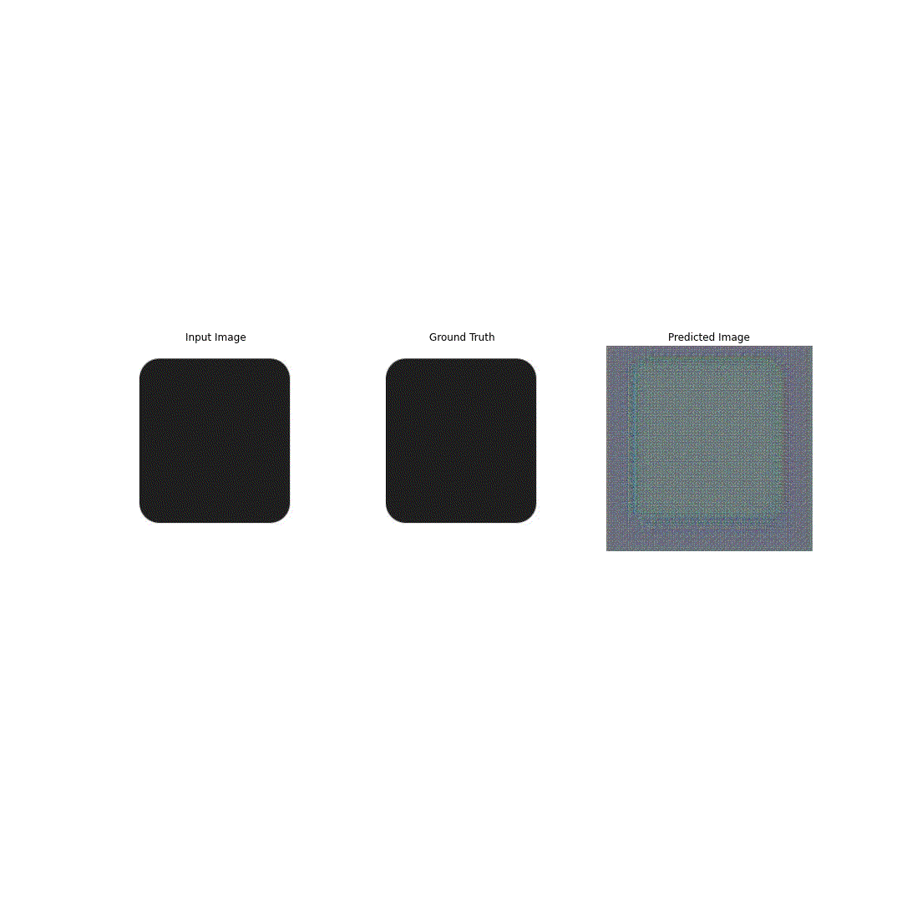
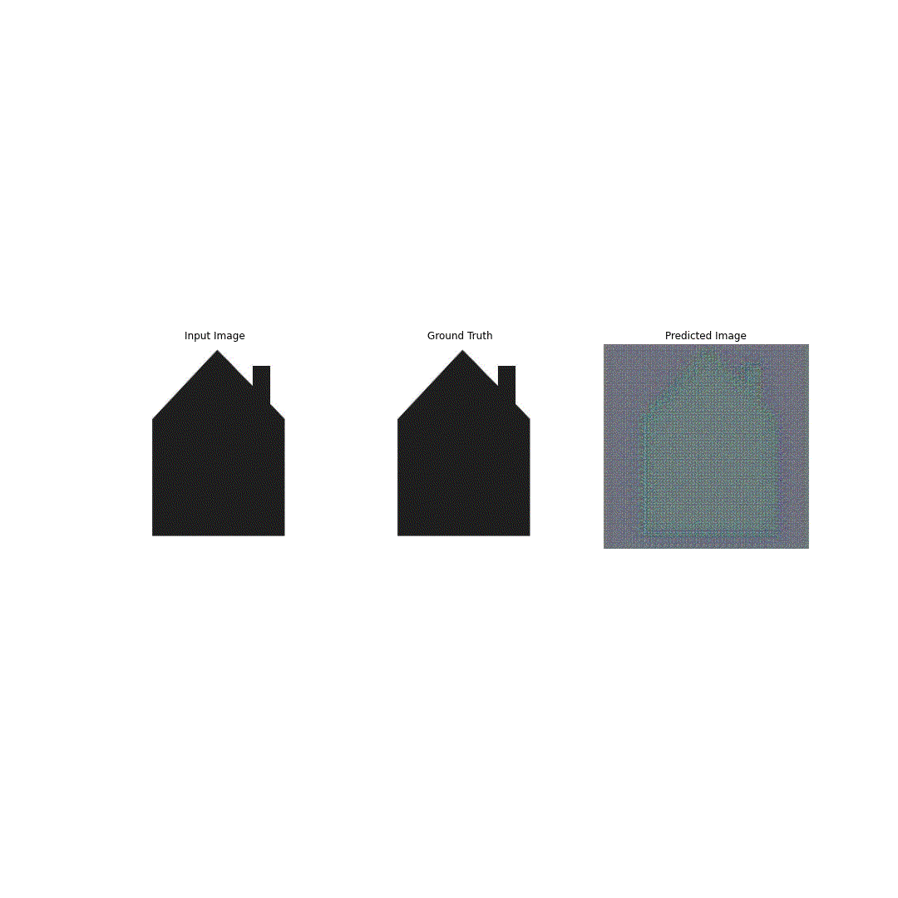
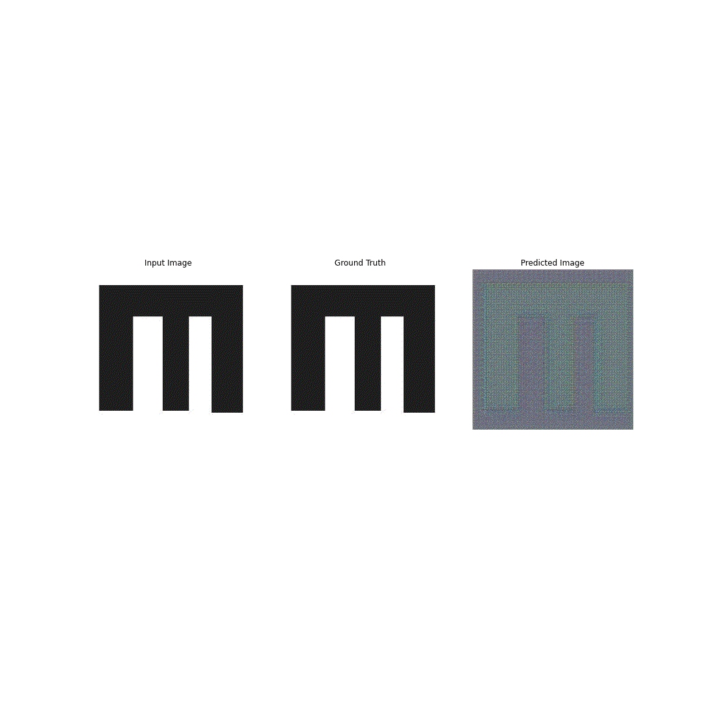

# Floor Plan Generation via Generative Adversarial Networks

## Problem Statement

**Can AI be applied to floor plan analysis and generation in order to assist the design process?** 
The end goal would be to create a larger quantity of choices and to give the client a library of choices to create more interest in the process.  
The problem statement originally stemmed from creating ADU floor plans and will focus on those specific floor plans

## Generative Adversarial Neural Networks in a Nutshell

* Generator - creates “fakes” from the training set
* Discriminator - chooses between real and “fake” and gives the generator feedback
* Generator creates more relevant “fakes”

## pix2pix as the GAN of Choice

* Conditional GAN
* Generator uses training data
* Uses L1 and gen/disc loss as internal metrics

## Methodology

The plan is to gather as many floor plans of ADU's as possible. I will create programmatic diagrams for all floor plans in order to create a consistent dataset and to also inform the model of different room use. I will also attempt to create different models to create more accurate results and to gain insights into what helps or hurts the model.  

I will keep an eye on Disc/Gen Loss as it is important that both losses are in range within each other so that neither model "wins." However, the most important metric will be the eyeball test. These floor plans will be shown to people and it should be readable to them. I created multiple categories to classify floor plans:
* Poor: Mess of a layout, no ability to tell what rooms should be
* Average: Some order programmatically, but rooms consistently not well defined
* Good: Good program definition overall with few obvious mistakes and only a few touch-ups from being excellent
* Excellent: Almost indiscernible from training set with few smudges acceptable, could potentially be shown to a client

## Dataset Examples

## Generator / Discriminator Model Layers

## Model One: 125 Image Dataset

Diagramming all floor plans taking too long so setting up an initial model to get a baseline idea how the model will perform

## Model Two: 199 Image Dataset

Final diagrams for training dataset created. Hopefully will lead to better predictions

## Model Three: 199 Image Extended Dataset

Steps changed to 500,000 from 125,000 to see how model performs for an overly extended period of time.

## Model Four: Simple Image Dataset

Floor plans with more than six sides or angled walls removed from dataset to try to achieve a more focused training dataset. Steps back to 125,000.

## Model Five: Exterior Doors Dataset

Exterior doors added to initial input to see if model is better guided with a little more initial data.

## Model Six: Tricky Floor Plans Dataset

Fabricated floor plans to see how model reacts to data not totally matching training dataset. 20 are of geometry similar to dataset, but not centered along origin. Other 20 are of overly complex geometry. All floor plan diagrams will be used as training dataset.

## Analysis

* Model shows a lot of promise
* Biggest improvements came from adding more data
* No improvements from modifying disc/gen
* Inputs not matching training set drops off greatly
* Model prone to overfitting
* Model does not understand scale

## Steps Forward

* Model needs more data
  * Apartments/cabins
  * Create my own floor plans
* Disc/gen optimization
* Implement square footage as a feature
* Could look at a cycle GAN
* Look into other aspects of ADU modeling
* Create a model with no floor plan discrimination

## Sources

* pix2pix Tutorial: https://www.tensorflow.org/tutorials/generative/pix2pix
* Floor Plan Sources:
  * https://www.snapadu.com/snapadu.com/
  * https://www.delmar.ca.us/815/ADU-Sample-Floor-Plans
  * https://www.hybridcorehomes.com/adu/
  * https://proteus.homes/floor-plans/
  * https://superioradus.com/
  * https://www.sandiegocounty.gov/content/sdc/pds/bldg/adu_plans.html
  * https://www.ladbs.org/adu/standard-plan-program/approved-standard-plans
  * https://adore-homes.com/models/
  * https://villahomes.com/units/#1-bedroom
  * https://abodu.com/quickship/
  * https://www.cotta.ge/
  * https://adumarin.org/floorplans
  * https://www.dwell.com/article/adu-floor-plans-06b805c4
  * https://maxablespace.com/accessory-dwelling-unit-floor-plans/
  * https://www.modernaduplans.com/adu-plans

## Modeling Animated

                    
